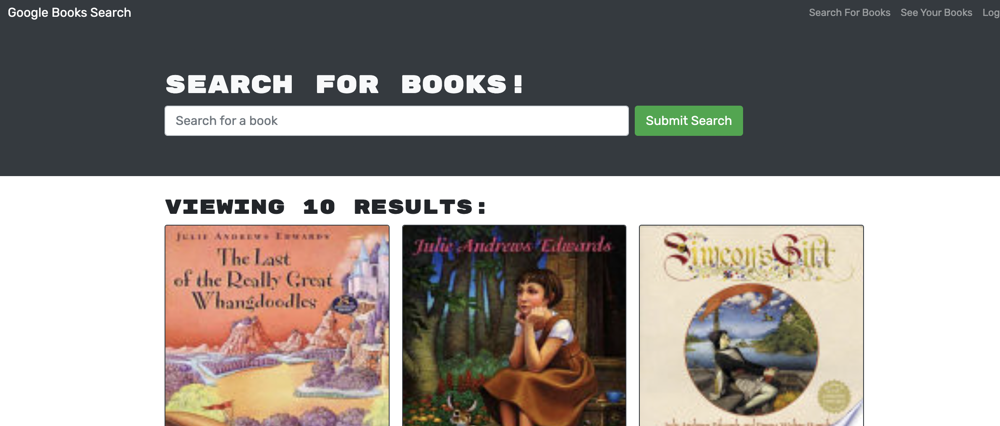

# Book-Search-HW 

## Description

This app allows the user to search for books using Google's book search API.  A user can save books and view saved books if they are logged in.

## Table of Contents

- [Usage](#usage)
- [Assets](#assets)
- [Credits](#credits)
- [License](#license)
- [GitHub Profile](#github-profile)
- [Contact by Email](#email)

## Usage

A user needs to create an account to be able to save books.

## Assets

[Live Site](https://secure-taiga-23715.herokuapp.com/)

## Credits

Application uses Google's book Api.

## License

This project is licensed with MIT.

### GitHub Profile

[My Profile](https://github.com/audrey-g37)

### Email

audrey.gillies@gmail.com
